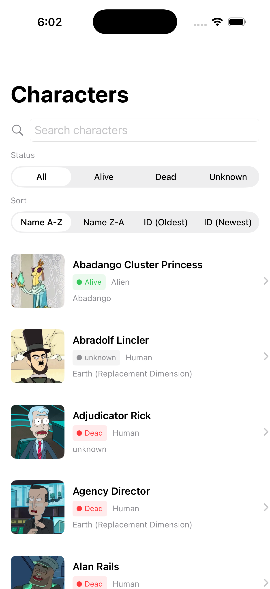
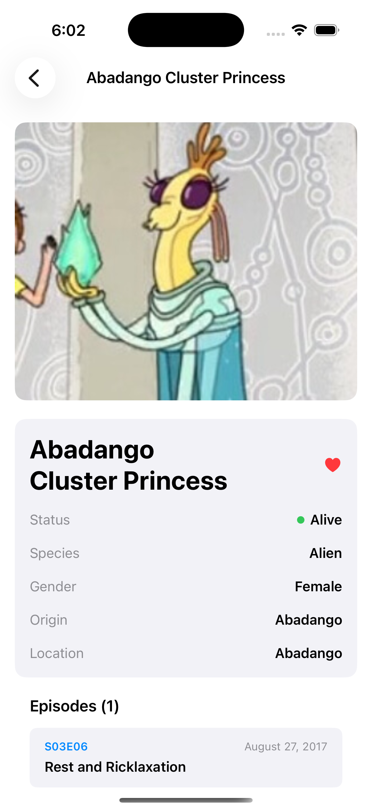

# Rick and Morty Assignment

A SwiftUI-based iOS application showcasing the Rick and Morty universe with a comprehensive character browser, detailed character information, and episode tracking.

## Screenshots

### Character List


### Character Details


## Video Demo

Watch the app in action:

<video src="Screenshots/demo.mp4" width="350" controls></video>

---

## Setup Instructions

### Requirements
- **Xcode**: 16.0 or later
- **iOS**: 18.0 or later
- **macOS**: 14.0 or later (for development)

### Build Steps

1. **Clone the repository**
   ```bash
   git clone <repository-url>
   cd RickMortyAssignment
   ```

2. **Open the project**
   ```bash
   open RickMortyAssignment.xcodeproj
   ```

3. **Build the project**
   - Select the target device or simulator
   - Press `Cmd + B` to build
   - Press `Cmd + R` to run

### Dependency Installation
The project uses Swift Package Manager (SPM) for dependency management. Dependencies are automatically resolved when opening the project:

- **SnapshotTesting**: For snapshot testing UI components

No additional manual dependency installation is required. All dependencies are configured in the Xcode project and will be automatically downloaded and linked.

---

## Architecture Overview

This project follows a clean architecture pattern with clear separation of concerns:

### Project Structure

```
RickMortyAssignment/
├── App/                    # App entry point and configuration
├── Models/                 # Data models (Character, Episode, APIResponse)
├── Networking/             # HTTP client, request handling, image caching
├── Repositories/           # Data access layer (CharacterRepository, EpisodeRepository)
├── ViewModels/            # Business logic for views
├── Views/                 # SwiftUI components
├── Services/              # Application services (StatusService, etc.)
├── Persistence/           # Data persistence and caching
└── Resources/             # Assets and configurations
```

### Key Components

- **MVVM Architecture**: Views are bound to ViewModels that manage state and business logic
- **Repository Pattern**: Abstracts data sources (network and persistence)
- **HTTP Client**: Custom `HTTPClient` for API communication with the Rick and Morty API
- **Image Caching**: `ImageCache` service for efficient image loading and storage
- **Persistence Layer**: Core Data integration via `PersistenceController` for offline data access
- **Error Handling**: Comprehensive `NetworkError` handling and logging via `AppLogger`
- **Async/Await**: Modern Swift concurrency for network operations

### Architecture Highlights

1. **Networking Layer**: 
   - Custom HTTP client with configurable requests
   - Image caching to reduce bandwidth and improve performance
   - Structured error handling with `NetworkError` enum

2. **Data Layer**:
   - `CharacterRepository` and `EpisodeRepository` for data access
   - Core Data persistence for offline support
   - Cached character extensions for data manipulation

3. **Presentation Layer**:
   - SwiftUI-based responsive UI
   - `CharacterListViewModel` and `CharacterDetailViewModel` for state management
   - Reusable components (AsyncImageView, LoadingView, ErrorView)

4. **Search & Filter**:
   - `SearchAndFilterView` for querying characters
   - Dynamic filtering by name and other attributes

---

## Features

### Character Browser
- Browse all characters from the Rick and Morty universe
- Infinite scrolling for seamless content exploration
- Display character information with beautiful card layouts

### Search & Filter
- Search characters by name
- Filter characters by status (Alive, Dead, Unknown)
- Real-time filtering with optimized performance

### Character Details
- Comprehensive character information display
- Character origin and location details
- Episode appearances with links
- Character image caching for fast loading

### Image Management
- Efficient image caching system to reduce network requests
- Async image loading with loading and error states
- Automatic cache management

### Offline Support
- Persistent storage of character data
- View previously loaded characters offline
- Core Data integration for robust data persistence

### Error Handling & Logging
- Comprehensive error handling with user-friendly messages
- Application logging for debugging and monitoring
- Error recovery with retry mechanisms

### Testing
- Unit tests for models and services
- Snapshot testing for UI components
- UI tests for critical user flows

---

## Assumptions

1. **Network Connectivity**: The app assumes internet connectivity for initial data loading. Cached data can be viewed offline.

2. **API Availability**: The application depends on the Rick and Morty API (rickandmortyapi.com) being available and maintaining its current schema.

3. **Image Loading**: Character images are loaded from external URLs and cached locally. Image quality and availability depend on the API's image hosting service.

4. **iOS Version**: Minimum iOS 18.0 is required. Features may be limited on older versions, and the app is optimized for the latest iOS releases.

5. **Device Storage**: The app uses Core Data for persistence, which requires sufficient device storage. Cache size is managed to prevent excessive storage usage.

6. **Memory Management**: The app implements memory-efficient image caching to handle large datasets without excessive memory consumption.

7. **API Rate Limiting**: The Rick and Morty API may have rate limiting. The app respects these limits through proper request handling.

---

## Testing

Run the test suite with:
```bash
Cmd + U
```

Tests include:
- **Unit Tests**: Model validation, service tests
- **Snapshot Tests**: UI component visual regression testing
- **UI Tests**: End-to-end user workflow testing

---

## Support

For issues or questions, please refer to the Rick and Morty API documentation: https://rickandmortyapi.com/

